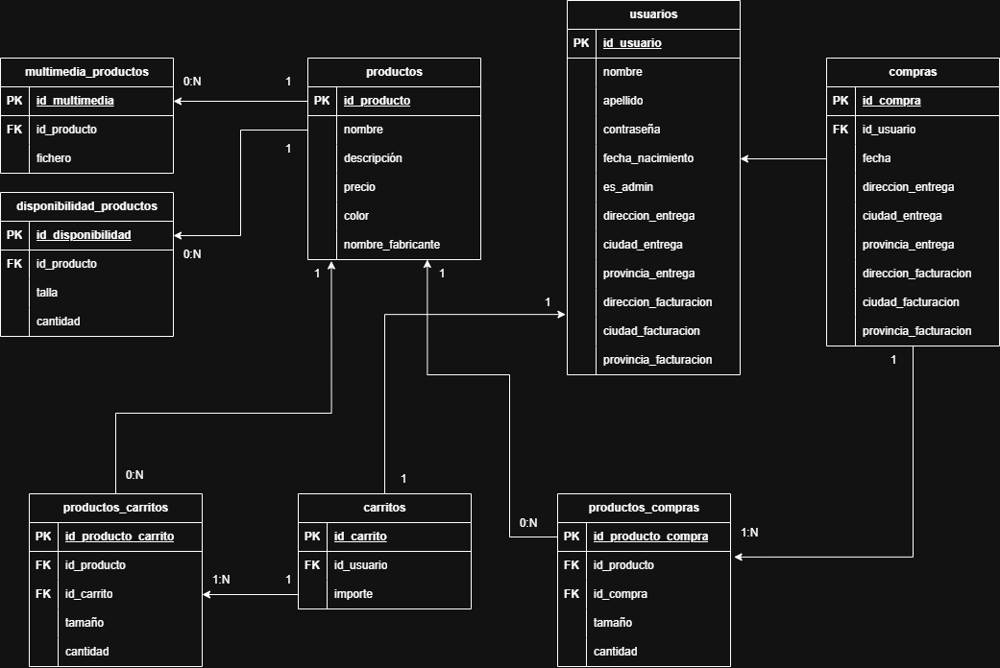

# Tablas de la tienda online

Las principales entidades a destacar son los siguientes:

- Productos (Zapatos)
- Usuarios
- Carritos
- Compras

Luego cada uno tendrá su normalización en várias tablas.

# Productos (Zapatos)

Los productos deben tener las siguientes columnas:

- ID Producto
- Nombre
- Descripción
- Precio
- Color
- Nombre fabricante

Para gestionar el stock, vamos a tener otra tabla para **disponibilidad productos**, con la siguiente estructura:

- ID entrada
- FK ID Producto
- Talla
- Cantidad

Ejemplo: Del producto con ID 1234 en talla 45 tenemos 3 disponibles

Cada producto tendra **1 a varios imagenes** asociados, entonces tendremos la tabla multimedia productos con:

- ID Multimedia
- FK ID Producto
- Nombre del fichero de la imagen

# Usuarios

Los usuarios pueden ser administradores o no, mas roles no hay, entonces eso se especificara con un booleano, asi serán las columnas:

- ID Usuario
- Nombre
- Apellidos
- Contraseña en Hash
- Fecha nacimiento
- Es administrador (Booleano)
- Ciudad de entrega
- Provincia de entrega
- Dirección de facturación
- Ciudad de facturación
- Provincia de facturación

# Carritos

Cada usuario va a tener asociado un carrito, la tabla de carrito sera la siguiente:

- ID Carrito
- FK ID Usuario
- Total en euros

Luego, para almacenar los productos asociados a cada usuario, usamos otra tabla con estos campos:

- ID Producto-carrito
- FK ID Producto
- FK ID Carrito
- Tamaño
- Cantidad

# Compras

Cada compra tendra los siguientes datos:

- ID Compra
- FK ID Usuario
- Fecha compra
- Ciudad de entrega
- Provincia de entrega
- Dirección de facturación
- Ciudad de facturación
- Provincia de facturación
- Importe total de la compra

Y cada compra tendra **1 a varios articulos** entonces necesitamos una tabla de productos_compra :

- ID Producto-compra
- FK ID Producto
- FK ID Compra
- Cantidad
- Tamaño